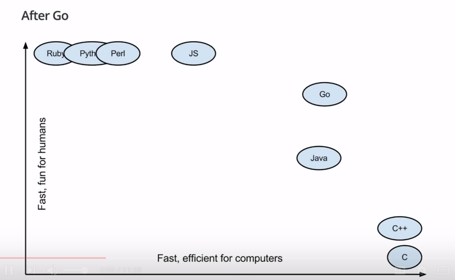
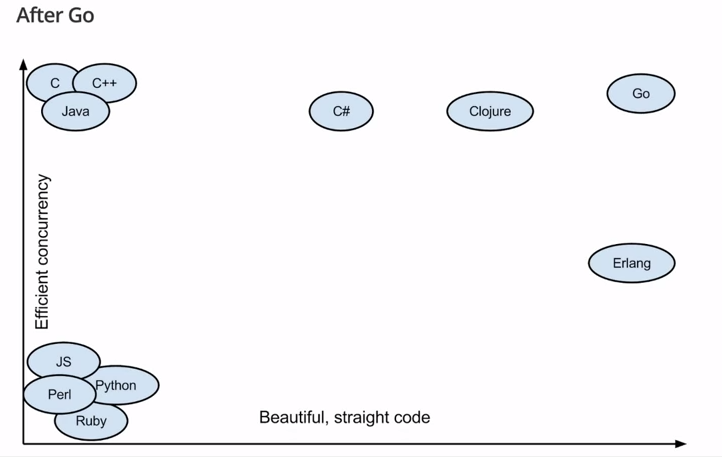

# Go 101 - Introduction to Go
<!-- markdown-toc start - Don't edit this section. Run M-x markdown-toc-refresh-toc -->
**Table of Contents**

- [Go 101 - Introduction to Go](#go-101---introduction-to-go)
    - [What is Golang](#what-is-golang)
    - [Why Golang](#why-golang)
    - [Where is Go in the landscape of programming languages.](#where-is-go-in-the-landscape-of-programming-languages)
    - [The advantages of Go](#the-advantages-of-go)
    - [Programs written in Go](#programs-written-in-go)
    - [Companies who use Golang](#companies-who-use-golang)
    - [Companies in the Netherlands](#companies-in-the-netherlands)
    - [API's and / or clients for /of GO](#apis-and--or-clients-for-of-go)
    - [Concurrency](#concurrency)
    - [Tips on learning Go](#tips-on-learning-go)

<!-- markdown-toc end -->

## What is Golang
Go is a fairly new programming language (announced in 2009 and offically released in 2012) created by Google and built from the ground up.
Keep in mind that every language has it's advantages and disadvantages. There's no such thing as a perfect programming language and every language has it's field where it excels.

## Why Golang
According to the creators of Go:
> Why are you creating a new language?  
> Go was born out of frustration with existing languages and environments for systems programming. Programming had become too difficult and the choice of languages was partly to blame. One had to choose either efficient compilation, efficient execution, or ease of programming; all three were not available in the same mainstream language. Programmers who could were choosing ease over safety and efficiency by moving to dynamically typed languages such as Python and JavaScript rather than C++ or, to a lesser extent, Java.  

> Go is an attempt to combine the ease of programming of an interpreted, dynamically typed language with the efficiency and safety of a statically typed, compiled language. It also aims to be modern, with support for networked and multicore computing. Finally, working with Go is intended to be fast: it should take at most a few seconds to build a large executable on a single computer. To meet these goals required addressing a number of linguistic issues: an expressive but lightweight type system; concurrency and garbage collection; rigid dependency specification; and so on. These cannot be addressed well by libraries or tools; a new language was called for.  

Watch this [video](https://www.youtube.com/watch?v=5bYO60-qYOI&feature=youtu.be&t=3m6s) where the need for a new language is explained. 

## Where is Go in the landscape of programming languages.
Go is somwhere between the compiled languages as C and C++ and the interpreted languages as Java and Python.

## The advantages of Go

Most of the software we at DutchSec create, is written in Go: Honeytrap, Raven, Cyberborg and a part of Marija. Plus hodor, wodan and our Pastebin scraper.
Why do we work with Go?
* Networking possibilities: comprehensive net package. Networking is a great deal of our core business.
* System libraries: comprehensive io and os packages. 
* Type safety.
* Because of gofmt and type safety, easy to work on projects with a large team of developers. Always the same codig style.
* Stable.
* Compiles fast. One of the conditions the makers demanded.
* Single file binary. The whole program including dependencies are compiled into one file. No need for VM's or runtimes.

* Cross-compilation. It's fairly easy to compile a Go program for other architectures and operating systems. The most used architectures and operating systems are supported.
* Syntax is clean and simple. No need for unnescesary bracket or parenthesis.
* Integrated support for C libraries.
* Golang is not object oriented by definition but has different ways for inheritance.  
* Go also has object oriented-like features but uses them in a slighty different way. Go has no classes nor inheritence but uses alternative mechanisms to define relationships. Read [this](http://spf13.com/post/is-go-object-oriented/) blogpost to get a better understanding. 
  
## Programs written in Go
* Docker
* Kubernetes
* Soundcloud
* Cloudefare's Railgun
* InfluxDB

## Companies who use Golang
* Facebook
* Twitter
* Youtube
* Apple
* Dropbox
* Uber  

## Companies in the Netherlands
* Bol.com
* Datumprikker

## API's and / or clients for /of GO 
* Youtube
* Pulsar
* Ethereum
* Docker
etc...

## Concurrency
The part where Go really excels is _concurrency_. In Go, starting multiple processes at the same time is easy and without clutter.  
  

## Tips on learning Go
* Use multiple sources/tutorials while learning Go.
* Make sure set all paths correctly(GOROOT, GOPATH, /bin, PATH etc.). This will save you a lot of frustration.
* Spacemacs has a lot of powerful and indispensable tools that make working with Go al lot easier. Take a look [here](https://github.com/syl20bnr/spacemacs/tree/master/layers/%2Blang/go).
* Get to know all the important packages. Al lot of work has already been done and you don't have to reinvent the wheel.
* Channels and Go-routines are powerful tools. Use them to your advantage.
* Dep is a dependency tool for Golang. It will both keep track on dependency versions as well store them in a vendor folder within your project folder. 
* You can try Golang in a browser. From the official [website](https://play.golang.org/) and with colored syntax plus documentation [here](https://goplay.space/).
